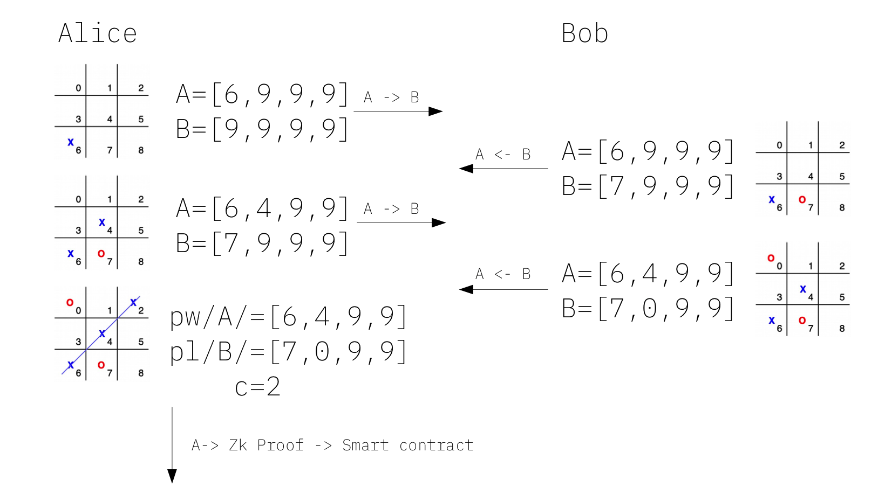

# Tic-tac-toe using ZK SNARK


## Position numbers


## Input structure

- **field[4] pw** - list of winner previous moves. It can be position number (0-8) or empty move (9)
- **field[4] pl** - list of loser previous moves. It can be position number (0-8) or empty move (9)
- **field c** - current move. It should be position number (0-8).

## Main protocol

Tic-tac-toe zk snark protocol:



## Verification


```
(0, 4, 8)
(2, 4, 6)
```


```
(0, 3, 6)
(1, 4, 7)
(2, 5, 8)
```


```
(0, 1, 2)
(3, 4, 5)
(6, 7, 8)
```

#### Main contition

```
pw + c ∈ (0, 1, 2) or
pw + c ∈ (3, 4, 5) or
...
pw + c ∈ (2, 4, 6)

```

#### Condition against cheating


```
Move1 != Move2 or ((Move1==Ø) and (Move2==Ø))
```

## Build

#### Generation of the circuit code

```
python generator.py
```

#### Compiling witness params for proof generation

compile java project in paramgroup folder

```
cd ./paramgroup
gradle fatJar
```

encode the game status according to the rules above and run the code. Command line parameters:
 * gameID
 * winner moves: pw[0] pw[1] pw[2] pw[3]
 * looser moves: pl[0] pl[1] pl[2] pl[3]
 * last winner move (which is not affected by looser game state signature)

```
java -jar ./build/libs/paramgroup-all-1.0-SNAPSHOT.jar 123 0 1 9 9 4 5 9 9 4 2
```

the goal is to have the compute-witness command out of this code. Example:
```
zokrates compute-witness -a 123 143110950276817851694412848238637525611 156833781044329042438065648861779802984 0 1 9 9 4 5 9 9 2
```


#### Compilation, Setup, Generation proof and verifier

```
./zokrates compile -i tictactoe.compiled.code
./zokrates setup
./zokrates compute-witness -a 123 143110950276817851694412848238637525611 156833781044329042438065648861779802984 0 1 9 9 4 5 9 9 4
./zokrates generate-proof
./zokrates export-verifier
````

#### Deployment & verification (Truffle & Ganache)
Extract verifier smart contract and proof.json from zokrates docker image
```
docker cp <docker_id>:/home/zokrates/verifier.sol ./contracts
docker cp <docker_id>:/home/zokrates/proof.json ./test/common/
```

make sure Ganache is running and run tests with truffle

```
truffle test
```

#### Deployment & verification (Dummy way)
Extract verifier smart contract from zokrates docker image
```
docker cp <docker_id>:/home/zokrates/verifier.sol ./<CONTRACT_PATH>
```
##### Deployment

* Open Remix browser https://remix.ethereum.org
* Open *verifier.sol* in Remix
* From the right side menu, select Compile tab.
* Push *Start to compile (Ctrl-S)* button. Make sure compilation is successful
* From the right side menu, select Run tab.
* Make sure Metamask is unlocked, network is selected to the one you need (Ropsten for example) and wallet selected has some ETH
* Push *Deploy* button (sign transaction in Metamask and wait until mined)

##### Verification

* Extract *proof.json* file from zokrates docker image
```
docker cp <docker_id>:/home/zokrates/proof.json ./<CONTRACT_PATH>
```
* Expand *verifyTx* function call tab.
* Fill in fields from *proof.json* (copy & paste).
* push *verifyTx* button. Confirm transaction in Metamask.
* When transaction mined, check that Verified("Transaction verified successfully") is emitted (on Etherscan)
